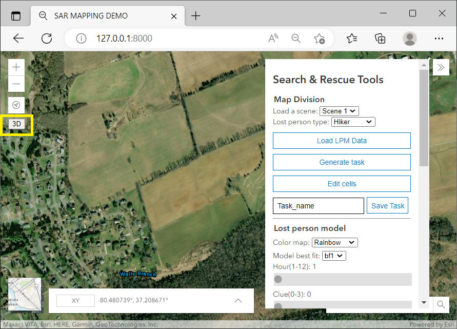

# SAR Web User Interface Demo (Updated 07/2022)





[more examples](screen/)
## Built based on
- DJango as sever
- ESRI js development platform,
- d3 for polygon and voronoi.
- SQLite as database
- DJango REST freamwork is needed

# Main demo page:
https://sar.caslab.ece.vt.edu/

# Experiment flow:
http://localhost:8000/experiment/consentform

- consent form remind (have a link to the qualtrics and check)
- a demographic questionnaire (once)
  - here we have an id for experiment and unixid for distinguish different users
- training session
- loop start (8)
- task
- post-task questionnaire
- loop end
- post experiment questionnaire

# Admin database page:
http://127.0.0.1:8000/admin
Create user: `python manage.py createsuperuser`

## Waypoint data:
Waypointsdata:
`[{"stamp":0,"timestamp":1,"long":-80.5724,"lat":37.187},{"stamp":2,"timestamp":2,"long":-80.5725,"lat":37.187},{"stamp":3,"timestamp":3,"long":-80.5735,"lat":37.187},{"stamp":4,"timestamp":4,"long":-80.5745,"lat":37.157},{"stamp":5,"timestamp":5,"long":-80.5755,"lat":37.167},{"stamp":6,"timestamp":6,"long":-80.5765,"lat":37.177}]`

-----------2021-------------
Windows setup
- db: change __init__.py -> use pymysql

Linux setup
- db: change __init__.py -> use mysqlclient

Reference
[ESRI Javascript API](https://developers.arcgis.com/javascript/latest/api-reference/esri-views-View.html#width)

URL
http://127.0.0.1:8000/app3/
-----------2019 07 09-------------
Add two methods of generate heatmap
- add coordinate to geojsonLayer
- add a png file to viewdiv


-----------2019 06 12-------------

If the migration sends errors, try:
- delete all tables in the db.sqlite3
- delete the migration folders
- manage.py makemigrations users
- manage.py migrate users

- manage.py makemigrations
- manage.py migrate

- manage.py makemigrations app3
- manage.py migrate app3

- manage.py createsuperuser
Enter username
Enter password
The username and password will be used to post/update gpsdatas.

New:
- Home page for sign up : http://127.0.0.1:8000
- admin page for user management:  http://127.0.0.1:8000/admin

-----------2019 05 17 ------------
1. Setup
[Django REST framework](https://www.django-rest-framework.org/tutorial/quickstart/)

pip install djangorestframework

In settings:

INSTALLED_APPS = [
    ...
    'rest_framework',
    ...
]

2. Stream GPS data to database:

Step 1) Post a new device

Step 2) Update GPS data

Code in python:  
```python
import requests

# create a new device, deviceis is the primary key
r = requests.post('http://127.0.0.1:8000/app3/gpsdatas/',auth=('username','password'), data = {'deviceid':'max_testing', 'taskid':'sar_put2','gpsdata':'{"gps":["stamp":004,"lat":-81,"log":37]}'})

# update record based on primary key. For example: "./max_testing/" is added as pk
r = requests.patch('http://127.0.0.1:8000/app3/gpsdatas/max_testing/', auth=('username','password'), data = {'deviceid':'max_testing', 'taskid':'sar_put2','gpsdata':'{"gps":["stamp":004,"lat":-80,"log":38]}'})
```

3. Operate in browser:
Open the link in chrome: http://127.0.0.1:8000/app3/gpsdatas/


Updates Log

--------------Nov------------------
1. Need to find the algrithm of generating convex polygon based on multi-points.
2. Add function of marking

-----------2019 02 18---------------
esri javascript
polygon
sketchviewmodel

Testing URL: http://127.0.0.1:8000/app3/sketch
